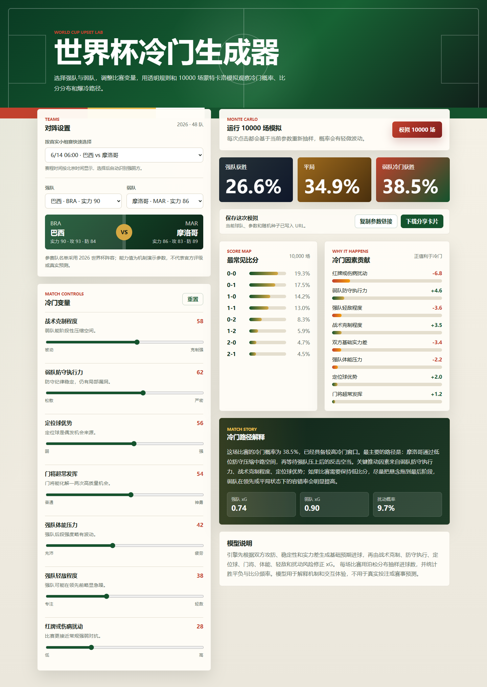
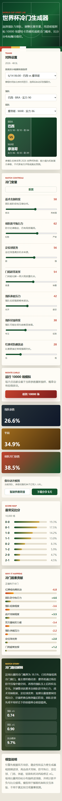

# 我做了一个「世界杯冷门生成器」：把爆冷从玄学变成一次可交互的模拟

世界杯最迷人的地方，往往不是强队顺利赢球，而是那些赛前没人看好的球队，在九十分钟里把所有预测推翻。

但“爆冷”究竟是纯粹的运气，还是可以拆解成战术、防守、定位球、门将状态、体能和突发事件共同作用的结果？带着这个问题，我做了一个可交互的网页项目——**世界杯冷门生成器（World Cup Upset Lab）**。

它不是一款下注工具，也不试图冒充真实赛事预测模型。它更像一座可以亲手调节的足球实验室：选择一支强队和一支弱队，改变比赛中的关键变量，再运行 10000 场蒙特卡洛模拟，观察冷门概率、常见比分和可能的爆冷路径如何变化。

图 1：桌面端完整模拟。项目支持按真实小组赛赛程快速选择，本次示例选择的是 6 月 14 日 06:00 的巴西 vs 摩洛哥，系统会自动识别强弱方，并同步展示概率、比分、因素贡献与冷门路径。

## 一、这个项目解决什么问题？

我们讨论比赛时，经常会说“弱队摆大巴”“强队轻敌了”“门将开挂”“一个定位球改变了比赛”。这些判断都很生动，但彼此之间缺少可以对照的尺度。

这个项目希望把这些足球语言转化为可操作的参数，让用户直观看到：当弱队防守更严密、定位球更有威胁，或者强队体能下降时，比赛结果的概率会怎样移动。

项目当前内置 2026 世界杯 48 支参赛队与 72 场真实小组赛赛程。赛程按照 A—L 组整理，开球时间统一转换为北京时间。用户从“按真实小组赛快速选择”下拉框选择比赛后，系统会自动带入主客双方，并根据能力参数识别强队与弱队；如果想测试假想对阵，也可以切换为自定义模式自由组合球队。

这里需要区分两类数据：球队名称、小组和比赛时间采用真实赛程数据快照；球队能力值、风格标签与模型权重则是为了机制演示而设置的产品参数，不是 FIFA 官方评级，也不代表真实比赛结论。

## 二、怎么玩？

使用过程只有三步：

1. 在 A—L 组的 72 场真实小组赛中选择一场，系统会按北京时间显示开球时间，并自动识别强弱方；也可以使用自定义对阵。
2. 调节七项比赛变量：战术克制、弱队防守执行力、定位球优势、门将发挥、强队体能压力、强队轻敌程度，以及红牌或伤病扰动。
3. 点击“模拟 10000 场”，查看强队获胜、平局和弱队爆冷获胜的概率。

每次模拟后，页面不仅会给出一个百分比，还会展示最常见比分、各因素对冷门的正负贡献，以及一段自然语言生成的“冷门路径解释”。用户看到的不只是“爆冷概率为 18.7%”，还能够理解这个数字为什么出现。

图 2：移动端完整页面。选择真实比赛后，页面会自动显示双方球队与能力参数，用户可以依次调节冷门变量、运行模拟并查看全部分析结果。

## 三、项目最核心的亮点

### 1. 可解释，而不是只给一个结果

很多预测页面只展示最终概率，但这个项目会同步给出因素贡献。例如，双方基础实力差通常会压低冷门概率，而战术克制、防守执行、定位球和门将发挥可能把概率重新推高。正负贡献使用条形图呈现，用户可以立即看出哪项变量最关键。

### 2. 10000 场蒙特卡洛模拟

真实赛程选择负责确定“模拟哪一场比赛”，模拟引擎负责计算“这场比赛可能怎样发展”。选择赛程后，系统会从球队数据中读取双方实力、进攻、防守、稳定性和风格标签，生成基础预期进球，再根据七项比赛变量修正双方 xG。每一场虚拟比赛都通过泊松分布抽样进球数，连续运行 10000 次后，统计胜、平、负和常见比分分布。

换句话说，这不是只把两个队名放在页面上：真实比赛选择会直接决定模拟所使用的双方球队参数。用户切换赛程，基础 xG、实力差、风格加成、比分分布和冷门解释都会随之重新计算。

这套模型追求的不是现实预测精度，而是规则透明、逻辑自洽和互动反馈。改变一个变量时，用户能够观察到相应结果，而不是面对一个无法解释的黑箱数字。

### 3. 结果可以分享和复现

球队、全部参数和模拟种子会自动写入 URL。把链接发给朋友，对方打开后可以恢复同一组设置和结果。项目还支持在浏览器本地生成 1200×630 的 PNG 结果卡片，不依赖后端截图服务。

### 4. 同时适配电脑和手机

桌面端采用左右双栏布局，方便一边调参数、一边观察结果；移动端会自动切换为单列结构，选择球队、拖动滑块和阅读分析都可以顺序完成。整个项目是纯前端应用，无须注册或上传个人数据。

## 四、一次有意思的实验

假设我们让一支明显处于下风的球队面对传统强队。默认参数下，实力差会占据主导，弱队获胜概率通常不高。

接下来逐步提高“战术克制程度”“弱队防守执行力”和“定位球优势”，再增加一点强队的体能压力与轻敌程度。此时可以看到两个明显变化：一是 0:0、1:1 等低比分结果增加；二是 0:1 这类弱队小胜比分出现得更频繁。

这很符合真实足球中的爆冷逻辑：弱队通常不是依靠持续对攻取胜，而是先压低比赛节奏和总进球数，再通过定位球、反击或突发事件制造一次决定性的机会。模型把这条路径变成了可以被用户亲手验证的过程。

## 五、设计与技术实现

项目使用 Vue 3、TypeScript、Vite 和 Composition API 开发，测试使用 Vitest。48 支球队数据与 72 场小组赛赛程保存在本地静态数据模块中，赛程组件负责分组展示、北京时间格式化与强弱方自动映射。模拟引擎、球队数据、界面组件、URL 状态和分享卡片生成均在浏览器本地完成，没有后端、数据库或外部 AI 接口。

为了避免极端参数产生明显失真的结果，模型对双方 xG 和扰动概率设置了边界约束。项目也明确标注：它是机制演示，不应用于投注或真实赛事判断。

界面视觉选择了深绿色球场、米白卡片和红黄强调色，希望保留传统足球转播与数据面板的感觉，同时避免把页面做成冰冷的专业分析软件。即使不了解统计学，用户也可以从滑块、百分比和图表中快速理解结果。

## 六、体验入口

GitHub 项目地址：

https://github.com/minglei531-lgtm/worldCupUpset

本地运行方式：下载项目后执行 `npm install` 和 `npm run dev`，即可在浏览器中体验。

如果你也对世界杯爆冷感兴趣，可以尝试设计一条自己的冷门路径：是把防守和门将拉满，还是押注定位球、体能下降与突发事件？同一场比赛，可能因为几个变量的变化呈现完全不同的故事。

本项目仅用于足球机制演示和编程创作，不代表官方评级或真实赛事预测，请勿用于投注。

#足球季 #VibeCoding挑战赛 #世界杯 #足球数据 #独立开发
